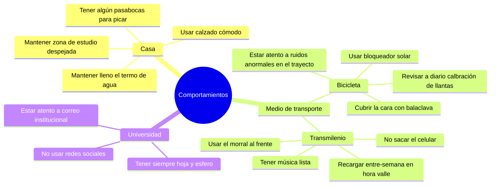
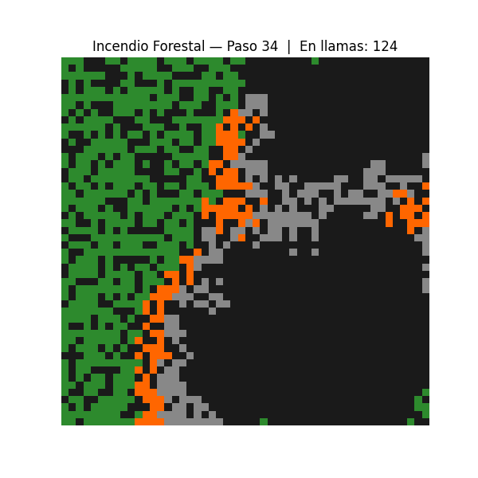
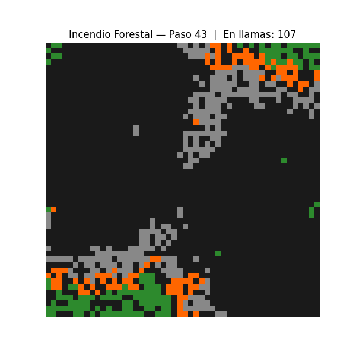
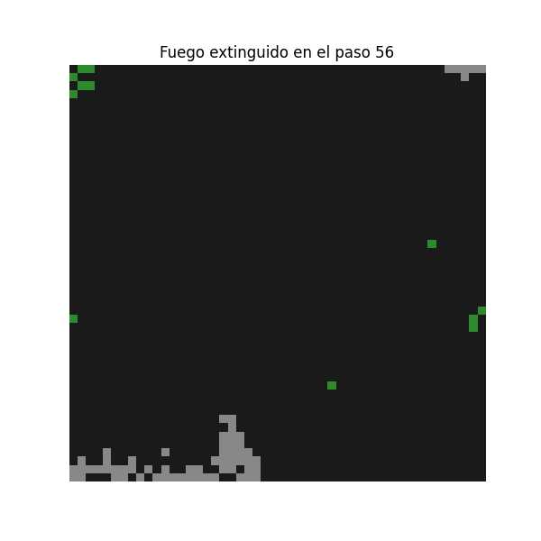
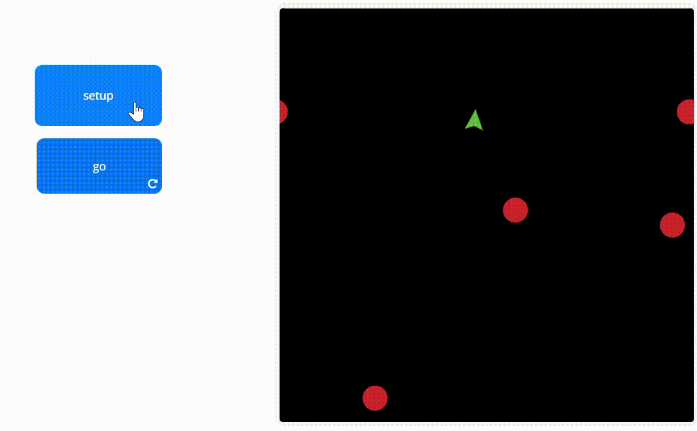
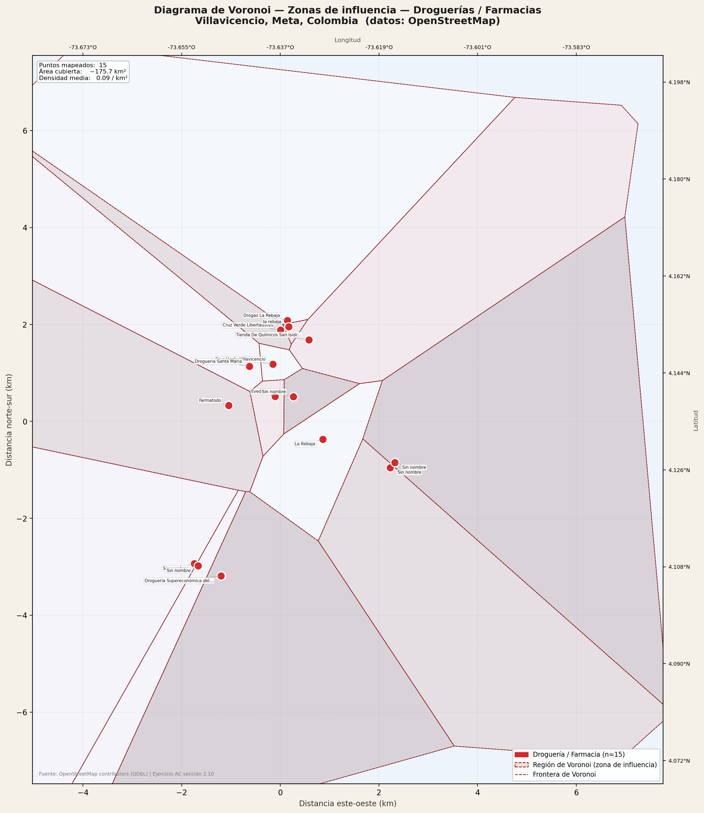
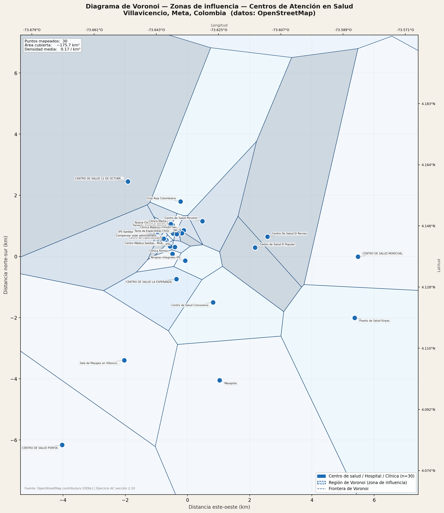
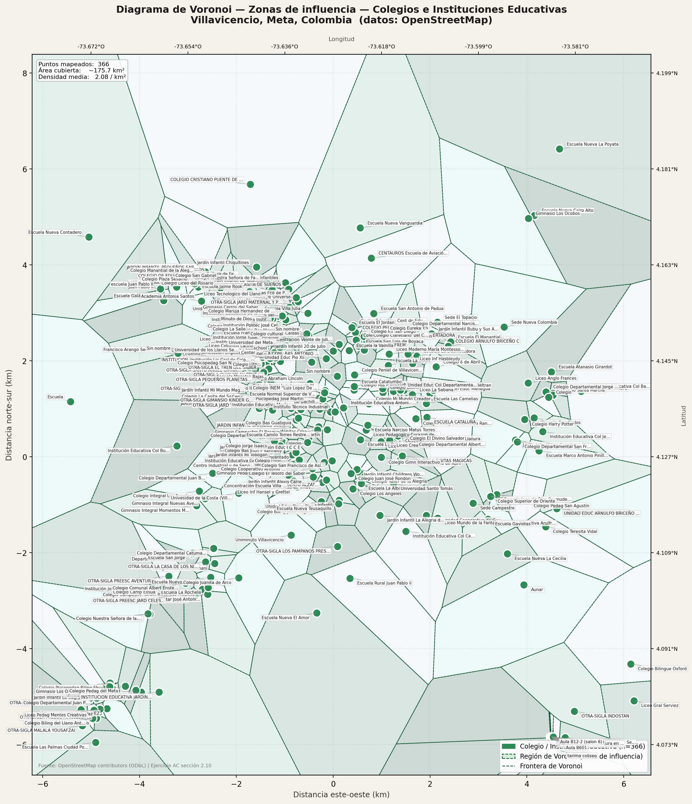

# Desarrollo Taller 2

# Respuesta 1

Reglas básicas sobre comportamiento en distintos lugares.



# Respuesta 2

## Simulación de incendio Forestal con autómatas celulares

Simulación probabilística de la propagación de un incendio forestal usando Autómatas Celulares (AC) 2D en Python. El modelo implementa la teoría de AC probabilísticos descrita en el material del curso, aplicada al ejercicio 2.

---

## ¿Qué es un autómata celular?

Imagina un estadio de fútbol durante la "ola". Nadie coordina el movimiento desde arriba: cada persona solo mira a sus vecinos inmediatos y reacciona. Sin embargo, desde las tribunas se ve un patrón ondulatorio perfectamente organizado. **Eso es un AC: complejidad global emergiendo de reglas locales simples.**

En esta simulación ocurre exactamente lo mismo. Ningún árbol "sabe" qué tan grande será el incendio. Cada árbol solo evalúa a sus 8 vecinos más cercanos y decide si se enciende o no. El resultado macro —la propagación del fuego, los frentes de llama, las zonas quemadas— **emerge** de esas interacciones locales.

Formalmente, un AC se define con una 5-tupla `(L, w, U, f, C₀)`:

| Componente                     | Definición                                 | En este modelo                                            |
| ------------------------------ | ------------------------------------------ | --------------------------------------------------------- |
| **L** — Retículo               | El espacio donde viven las células         | Grilla cuadrada de `SIZE × SIZE` celdas (50×50 = 2500)    |
| **w** — Alfabeto               | Los posibles estados de cada célula        | `{VACÍO, SANO, LLAMAS, CARBÓN}` = `{0, 1, 2, 3}`          |
| **U** — Vecindad               | Los vecinos que influyen en cada célula    | Vecindad de Moore: los 8 vecinos adyacentes               |
| **f** — Regla de transición    | La función que calcula el siguiente estado | `paso_tiempo()`: tres reglas probabilísticas y temporales |
| **C₀** — Configuración inicial | El estado del sistema en `t=0`             | `crear_mapa()`: bosque aleatorio con focos de fuego       |

---

## ¿Por qué es un AC probabilístico?

Los AC clásicos son deterministas: dado un estado de vecindad, el siguiente estado siempre es el mismo. Los **AC probabilísticos** permiten transiciones basadas en probabilidades, lo que los hace ideales para modelar fenómenos naturales donde interviene el azar, como la propagación del viento, la humedad o la densidad de vegetación.

En un incendio real, un árbol rodeado de fuego no se enciende con certeza absoluta en un instante fijo. La probabilidad de ignición crece con el número de vecinos ardiendo, siguiendo la fórmula:

```
P(ignición) = 1 - (1 - P_IGNICION)^n
```

donde `n` es el número de vecinos actualmente en llamas. Esto es el complemento de la probabilidad de que **ningún** vecino logre encender el árbol.

**Ejemplo con `P_IGNICION = 0.4`:**

| Vecinos ardiendo | Probabilidad de encenderse |
| :--------------: | :------------------------: |
|        0         |             0%             |
|        1         |            40%             |
|        2         |            64%             |
|        3         |            78%             |
|        4         |            87%             |
|        8         |           98.3%            |

Un árbol completamente rodeado de fuego casi con certeza se enciende. Un árbol con un solo vecino ardiendo tiene solo 40% de probabilidad. Esto modela fielmente el comportamiento real del fuego.

---

## Los estados de las celdas

Cada celda pasa por un ciclo de vida con cuatro estados:

```
VACÍO (0) ←─────────────────────────────────────────────────┐
                                                              │
SANO (1) ──[R1: prob = 1-(1-P)^n]──► LLAMAS (2) ──[R2: t≥T_QUEMA]──► CARBÓN (3) ──[R3: t≥T_CARBON]──┘
```

- **VACÍO `(negro)`** — Celda sin árbol. Puede ser zona vacía desde el inicio, o terreno ya completamente quemado tras completar el ciclo. Es un estado absorbente: una celda que llega aquí no se regenera durante la simulación.
- **SANO `(verde)`** — Árbol vivo susceptible de incendiarse. Su único riesgo es tener vecinos en llamas.
- **LLAMAS `(naranja)`** — Árbol ardiendo activamente. Permanece en este estado durante `T_QUEMA` pasos, propagando el fuego a sus vecinos en cada uno.
- **CARBÓN `(gris)`** — Árbol ya quemado, enfriándose. Permanece en este estado durante `T_CARBON` pasos. Ya no propaga el fuego. Al terminar, la celda queda VACÍA.

---

## Propiedades esenciales del AC implementadas

### Universo (Retículo)

La grilla `np.zeros((SIZE, SIZE))` es el espacio donde existe el AC. Es un arreglo regular 2D, también llamado teselación cuadrada.

### Homogeneidad

La misma función `paso_tiempo()` se aplica a **todas** las celdas sin excepción. No hay células especiales con reglas distintas.

### Paralelismo — la propiedad más crítica

El estado de **todas** las celdas se calcula simultáneamente a partir del estado anterior. En el código esto se garantiza con:

```python
nuevo_mapa  = mapa.copy()   # Se trabaja sobre una copia del estado actual
nuevo_timer = timer.copy()  # antes de modificar cualquier celda
```

Sin esta copia, si el árbol A se enciende y luego se evalúa su vecino B, B "vería" a A ya ardiendo —cuando en realidad A se encendió en este mismo paso. Eso rompería el paralelismo y haría que el resultado dependiera del orden de recorrido de las celdas.

### Localidad

Cada célula solo puede ser influenciada por sus **8 vecinos inmediatos**. Ninguna célula "conoce" el estado global del bosque. El incendio emerge únicamente de estas interacciones locales.

---

## Estructura del código

```
incendio_forestal.py
│
├── Parámetros globales          ← Controlan el comportamiento de la simulación
│
├── crear_mapa()                 ← Genera C₀: la configuración inicial
│   ├── Asigna SANO con probabilidad = DENSIDAD
│   └── Coloca NUM_FOCOS focos de LLAMAS aleatorios
│
├── vecinos_ardiendo()           ← Implementa la vecindad de Moore
│   └── Cuenta vecinos con estado == LLAMAS en el entorno 3×3
│
├── paso_tiempo()                ← Implementa f: la función de transición
│   ├── Copia el mapa actual (garantiza paralelismo)
│   ├── R1: SANO    → LLAMAS  (probabilístico, depende de vecinos)
│   ├── R2: LLAMAS  → CARBÓN  (determinista, después de T_QUEMA pasos)
│   └── R3: CARBÓN  → VACÍO   (determinista, después de T_CARBON pasos)
│
└── simular_incendio()           ← Bucle principal
    ├── Ejecuta paso_tiempo() hasta PASOS iteraciones
    ├── Visualiza con plt.imshow() en cada paso
    └── Termina si no hay LLAMAS activas
```

---

## Parámetros y su efecto

```python
SIZE       = 50     # Tamaño de la grilla (50×50 = 2500 celdas)
DENSIDAD   = 0.65   # Fracción de celdas con árbol sano al inicio
NUM_FOCOS  = 3      # Focos iniciales de incendio
P_IGNICION = 0.4    # Probabilidad base de ignición por vecino ardiendo
T_QUEMA    = 4      # Pasos que un árbol permanece en llamas
T_CARBON   = 6      # Pasos que el carbón permanece antes de quedar vacío
PASOS      = 120    # Número máximo de iteraciones
```

### Guía de ajuste

**`DENSIDAD`** es el parámetro más influyente. Existe un umbral de percolación (~0.59 para vecindad de Moore): por debajo, el fuego se extingue rápidamente porque los árboles están muy dispersos; por encima, puede propagarse por toda la grilla.

| Densidad    | Comportamiento esperado                                        |
| ----------- | -------------------------------------------------------------- |
| < 0.45      | El fuego se extingue muy rápido (pocos árboles)                |
| 0.55 – 0.65 | Propagación parcial, frentes irregulares, islas supervivientes |
| > 0.80      | El fuego consume casi todo el bosque                           |

**`P_IGNICION`** controla la agresividad de la propagación. Con 0.1 el fuego apenas avanza; con 0.9 cualquier árbol con un vecino ardiendo casi seguro se enciende.

**`T_QUEMA`** y **`T_CARBON`** definen la "memoria temporal" del sistema. Un árbol tiene exactamente `T_QUEMA` pasos para propagar el fuego a sus vecinos antes de apagarse. Valores altos crean incendios más duraderos y extensos.

**`NUM_FOCOS`** establece las condiciones iniciales (C₀). Múltiples focos pueden crear frentes independientes que se encuentran, se potencian o se extinguen por falta de combustible entre ellos.

---

## Las tres reglas de transición

### R1 — Ignición (SANO → LLAMAS)

```python
elif mapa[i, j] == SANO:
    n = vecinos_ardiendo(mapa, i, j)
    prob = 1 - (1 - P_IGNICION) ** n
    if random.random() < prob:
        nuevo_mapa[i, j]  = LLAMAS
        nuevo_timer[i, j] = 1
```

Solo se activa si hay al menos un vecino ardiendo (`n > 0`). La probabilidad crece no-linealmente con el número de vecinos. Si no hay vecinos ardiendo, el árbol permanece sano sin importar nada más.

### R2 — Combustión completa (LLAMAS → CARBÓN)

```python
elif mapa[i, j] == LLAMAS:
    if timer[i, j] >= T_QUEMA:
        nuevo_mapa[i, j]  = CARBON
        nuevo_timer[i, j] = 1
    else:
        nuevo_timer[i, j] = timer[i, j] + 1
```

Regla determinista. El árbol arde durante exactamente `T_QUEMA` pasos y luego se convierte en carbón. El `timer` registra cuántos pasos lleva ardiendo.

### R3 — Enfriamiento (CARBÓN → VACÍO)

```python
elif mapa[i, j] == CARBON:
    if timer[i, j] >= T_CARBON:
        nuevo_mapa[i, j]  = VACIO
        nuevo_timer[i, j] = 0
    else:
        nuevo_timer[i, j] = timer[i, j] + 1
```

Regla determinista. El carbón "se enfría" durante `T_CARBON` pasos y luego la celda queda permanentemente vacía.

### El rol del `timer`

El array `timer` es una extensión del estado que añade **temporalidad** al modelo. Sin él, el AC solo podría distinguir si una celda está o no en llamas, pero no sabría cuánto tiempo lleva ardiendo. Técnicamente, el estado real de cada celda es el par `(estado, timer)`, lo que amplía el alfabeto a 13 estados posibles sin necesidad de codificarlos explícitamente.

---

## Lectura de los resultados





La visualización usa un mapa de color de 4 valores directamente mapeado a los estados:

| Color      | Estado     | Qué indica                                        |
| ---------- | ---------- | ------------------------------------------------- |
| 🟫 Negro   | VACÍO (0)  | Sin árbol (inicial) o celda completamente quemada |
| 🟢 Verde   | SANO (1)   | Bosque intacto que el fuego no alcanzó            |
| 🟠 Naranja | LLAMAS (2) | Frente activo del incendio                        |
| ⬜ Gris    | CARBÓN (3) | Zona quemada enfriándose (desaparecerá pronto)    |

### Fenómenos emergentes a observar

- **Frente de fuego irregular**: la forma no es un círculo perfecto sino una masa fractal que refleja la distribución aleatoria de árboles y la estocasticidad de R1.
- **Islas supervivientes**: zonas verdes rodeadas por carbón, donde el fuego fue bloqueado por baja densidad local o mala suerte estadística.
- **Encuentro de frentes**: cuando dos focos se acercan, compiten por el mismo combustible y pueden extinguirse mutuamente antes de consumir toda la zona entre ellos.
- **Cortafuegos natural**: si en alguna dirección la densidad de árboles es localmente baja, el fuego puede detenerse espontáneamente, dejando bosque intacto más allá de esa zona.

### Métricas finales

Al terminar la simulación se imprime:

```
Fuego extinguido en el paso N
Árboles sanos restantes : X
Celdas vacías (quemadas): Y
```

- **Paso de extinción**: cuánto tardó el incendio en consumirse. Depende fuertemente de la densidad y la probabilidad de ignición.
- **Árboles sanos restantes**: una estimación del "daño" al ecosistema. En densidades altas, este número puede ser muy bajo.
- **Celdas vacías**: incluye tanto las zonas que ya eran vacías al inicio (sin árbol) como las que fueron quemadas.

---

## Instalación y ejecución

### Requisitos

```bash
python -m venv .venv
.\venv\Scripts\activate
pip install numpy matplotlib
```

### Ejecución

```bash
python problem-two.py
```

La simulación abre una ventana animada que se actualiza cada 0.15 segundos. Se detiene automáticamente cuando no quedan celdas en llamas o al alcanzar el número máximo de pasos.

---

## Conexión con la teoría del curso

| Concepto del paper                         | Implementación en el código                   |
| ------------------------------------------ | --------------------------------------------- |
| AC 2D con retículo cuadrado (§2.6)         | `np.zeros((SIZE, SIZE))`                      |
| Vecindad de Moore (§2.3, Fig. 2.6)         | `vecinos_ardiendo()` con `dx,dy ∈ {-1,0,1}`   |
| AC probabilístico (§2.7)                   | `prob = 1 - (1 - P_IGNICION)^n` en R1         |
| Actualización paralela (§2.4)              | `nuevo_mapa = mapa.copy()` antes de modificar |
| Configuración inicial C₀ (§2.3)            | `crear_mapa()` con distribución aleatoria     |
| Múltiples estados (§2.4)                   | `w = {0, 1, 2, 3}` con timer auxiliar         |
| Aplicaciones — incendios forestales (§2.8) | Todo el modelo                                |

---

## Referencias

- Martínez, J. J. — _Notas de Autómatas Celulares_, Capítulo 2, Febrero 2026
- Wolfram, S. — _A New Kind of Science_, Wolfram Media, 2002
- Mitchell, M. — _Introduction to Complexity_, MOOC, 2015
- Weisbuch, G., Rickebush, S. — _Complex System Dynamics_, Santa Fe Institute, 1990

# Respuesta 3

Para realizar la simulación podemos hacer uso de la herramienta vista en clase NetLogo Web, donde se crea un nuevo modelo con el siguiente código:

```
turtles-own [
  sensor-frontal
  sensor-izquierdo
  sensor-derecho
]

to setup
  clear-all

  create-turtles 1 [
    set color green
    set size 2
    setxy 0 0
  ]

  create-turtles 4 [
    set color red
    set size 2
    setxy random-xcor random-ycor
    set shape "circle"
  ]

  reset-ticks
end

to detectar
  ask turtle 0 [
    set sensor-frontal distance min-one-of other turtles [distance myself]

    rt 45
    set sensor-derecho distance min-one-of other turtles [distance myself]

    lt 90
    set sensor-izquierdo distance min-one-of other turtles [distance myself]

    rt 45
  ]
end

to mover
  ask turtle 0 [

    detectar

    if sensor-frontal < 3 [
      rt 90
    ]

    if sensor-izquierdo < 3 [
      rt 45
    ]

    if sensor-derecho < 3 [
      lt 45
    ]

    fd 1
  ]
end

to go
  mover
  tick
end
```

Para la interfaz se usa un botón de "setup" o configuración del entorno, y un botón "go", para iniciar el movimiento.



# Respuesta 4

## Diagramas de Voronoi — Zonas de influencia en Villavicencio, Meta

A lo largo del capítulo 2 del material del curso, los autómatas celulares se definieron sobre grillas cuadradas donde cada celda tiene exactamente los mismos vecinos, con las mismas distancias. Pero se plantea una pregunta clave en la sección 2.9:

> _"¿Pero qué pasa con la vecindad si la teselación no es regular?"_

Cuando tomamos el plano real de una ciudad, los servicios (droguerías, hospitales,
colegios) no están distribuidos en una cuadrícula perfecta. Están dispersos de forma
**irregular** sobre el territorio. Para poder definir la "vecindad" de cada punto del espacio
en este contexto real —es decir, para saber _a cuál servicio pertenece cada habitante_—
necesitamos una herramienta diferente: los **diagramas de Voronoi**.

---

### ¿Qué es un Diagrama de Voronoi?

Imagina que tienes varios pozos de agua en un desierto. Si caminas desde cualquier
punto del desierto hacia el pozo más cercano y trazas el camino, eventualmente llegarás
a una línea imaginaria donde dos pozos están exactamente a la misma distancia. Esa
línea es una **frontera de Voronoi**. Todo el terreno queda dividido en zonas, una por
cada pozo, donde cada zona contiene todos los puntos más cercanos a ese pozo que a
cualquier otro.

Eso es exactamente un diagrama de Voronoi: **una partición del espacio en regiones de
proximidad**, una por cada punto de interés (llamado _sitio_ o _generador_).

### Definición formal

Dado un conjunto de puntos (sitios) $P = \{p_1, p_2, \ldots, p_n\}$ en el plano, el
**diagrama de Voronoi** divide el plano en $n$ regiones $R_i$ tal que:

$$R_i = \{ x \in \mathbb{R}^2 \mid d(x, p_i) \leq d(x, p_j) \text{ para todo } j \neq i \}$$

Donde $d(x, p_i)$ es la distancia euclidiana del punto $x$ al sitio $p_i$.

En palabras simples: **cada región contiene todos los puntos del plano que están más
cerca de su sitio que de cualquier otro sitio.**

### Las fronteras de Voronoi

Las líneas que separan dos regiones adyacentes son segmentos de la **mediatriz**
(bisectriz perpendicular) del segmento que une los dos sitios vecinos. Esto garantiza que
cualquier punto sobre la frontera está exactamente a la misma distancia de los dos sitios
que separa.

---

## Voronoi como vecindad irregular en los AC

El paper del curso (sección 2.4) explica que la **vecindad** es el concepto fundamental
en los autómatas celulares: el estado de una célula depende del estado de sus vecinas.
En los AC clásicos esta vecindad es regular (Moore: 8 vecinos; Von Neumann: 4 vecinos).

El diagrama de Voronoi generaliza este concepto al mundo real:

| Elemento AC clásico            | Equivalente en Voronoi                    |
| ------------------------------ | ----------------------------------------- |
| Retículo cuadrado regular      | Mapa real de la ciudad                    |
| Célula (cuadrado de la grilla) | Punto de servicio (droguería, colegio...) |
| Vecindad de Moore              | Región de Voronoi                         |
| Frontera entre celdas          | Mediatriz entre sitios                    |
| Homogeneidad                   | Misma regla: "el más cercano te atiende"  |

La región de Voronoi de una droguería es exactamente su **zona de influencia**: el
conjunto de todos los domicilios cuyo habitante llegaría antes a esa droguería que a
cualquier otra. Es la vecindad natural de ese punto de servicio en un espacio irregular.

### Una analogía cotidiana

Piensa en los barrios de una ciudad. Cuando necesitas ir al banco más cercano, al médico
más cercano o al colegio más cercano, intuitivamente estás calculando Voronoi en tu
cabeza: ¿cuál de todos los puntos disponibles está a menor distancia de donde estoy?
Sin saberlo, cada habitante de la ciudad vive dentro de una región de Voronoi para cada
tipo de servicio.

---

## Metodología

### Datos

Los puntos de interés fueron obtenidos directamente de **OpenStreetMap (OSM)** usando
la API Overpass con el bounding box del área urbana de Villavicencio
(`4.07°N–4.20°N`, `73.68°O–73.57°O`). Los tags consultados fueron:

| Capa       | Tags OSM                                                                      |
| ---------- | ----------------------------------------------------------------------------- |
| Droguerías | `amenity=pharmacy`, `shop=chemist`, `healthcare=pharmacy`                     |
| Salud      | `amenity=hospital/clinic/doctors`, `healthcare=hospital/clinic/centre/doctor` |
| Colegios   | `amenity=school/college/university/kindergarten`                              |

### Conversión de coordenadas

Las coordenadas geográficas (latitud/longitud en grados) se convirtieron a un sistema
plano local en kilómetros mediante proyección equirrectangular local:

```
x (km) = (lon - lon_centro) × 111.0 × cos(lat_centro)
y (km) = (lat - lat_centro) × 111.0
```

Esta aproximación es válida para áreas pequeñas (< 50 km) donde la curvatura de la
Tierra es despreciable.

### Cálculo del Voronoi

Se usó `scipy.spatial.Voronoi` con puntos fantasma en los bordes del bounding box
para cerrar las regiones periféricas que de otro modo se extenderían al infinito.

## Resultados

### Mapa 1 — Droguerías / Farmacias (n = 15)



### Mapa 2 — Centros de Atención en Salud (n = 30)



### Mapa 3 — Colegios e Instituciones Educativas (n = 366)



---

## Cómo leer los mapas

Cada mapa tiene el mismo lenguaje visual:

- **Punto coloreado** → ubicación real del servicio según OSM
- **Región de color** → zona de influencia (Voronoi): todo punto dentro de ella está
  más cerca de ese servicio que de cualquier otro del mismo tipo
- **Línea punteada** → frontera de Voronoi: equidistante entre dos servicios vecinos
- **Región grande** → baja densidad de servicio, el ciudadano promedio debe recorrer
  más distancia
- **Región pequeña** → alta densidad, varios servicios compiten por una zona pequeña

---

## Análisis

### ¿Puede faltar una droguería en Villavicencio?

_[Si, falta según el resultado de la iamgen, ya que solo hay 15 droguerias que fueron arrojados por la herramienta de mapeo Open Street Map, al haber solo 15 droguerias crea regiones de Voronoi grandes por lo que la zona de influencia es demasiado grande y los habitantes de dichos sectores tienen que realizar un mayor desplazamiento hasta el nodo o drogueria, tambien se puede observar que se agrupan especialmente en una región. Puede que en google maps aparezcan más droguerias.]_

---

### ¿Puede faltar un centro de atención en salud?

_[En la perfieria es donde se ve mas ausencia de centros de salud, claramente en menor medida que la cantidad de droguerias (esto tambien depende de la capacidad de la herramienta Open Street Map), y como vimos con las dorguerias, aqui tambien se agrupan los centros de salud en una region especifica, por lo que es de considerar que mas que aumentar la cantidad de centros de salud, es la de distribuir estos en el territorio.]_

### ¿Puede faltar un colegio?

_[Es el servicio que tiene mas puntos o nodos dentro el territorio y que tiene la mejor distribucion, es posible señalar que no se requiere aumentar la cantidad de colegios ya que son suficientes en la region urbana y las areas del diagrama de Voronoi son de menor tamaño, pero si es necesario aumentar la presencia del sistema educativo en las zonas perifericas.]_

### ¿Hay alguna relación entre los tres diagramas?

_[Hay varios detalles a rescatar, en primer lugar la cantidad de droguerias y su ubicación, coincide con la ubicacion y la cantidad de los centros de salud, y de la misma manera la ausencia coincide entre los dos tipos de servicios, donde a medida que se aleja del centro, aumenta el tamaño de los diagramas de Voronoi lo que implica que es menor la cantidad de estos servicios en dirección a la periferia.]_

## Limitaciones del análisis

- **Cobertura OSM incompleta**: OpenStreetMap es un mapa colaborativo. En ciudades
  colombianas medianas como Villavicencio, muchos comercios y servicios no han sido
  mapeados aún. Los 15 droguerías encontradas son claramente una subestimación real
  (la ciudad tiene cientos). Esto afecta directamente la validez de las regiones de Voronoi.

- **Puntos sin nombre**: varios registros aparecen como "Sin nombre" en OSM, lo que
  dificulta su verificación.

- **Ruido en los datos de salud**: algunos registros etiquetados como centros de salud
  en OSM corresponden a masajistas o similares, que se incluyeron por tener el tag
  `healthcare` en sus atributos.

- **Distancia euclidiana vs. distancia real**: el diagrama de Voronoi usa distancia en
  línea recta. En la realidad, la accesibilidad depende de la red vial, el transporte
  público y las barreras físicas (ríos, pendientes). Un análisis más preciso usaría
  distancias sobre la red de calles (isócronas).

## Ejecución

```bash
# Instalar dependencias
pip install requests numpy matplotlib scipy

# Paso 1: descargar datos de OSM
python obtener_datos.py

# Paso 2: generar los tres mapas
python voronoi_tres_capas.py
```

---

## Referencias

- Martínez, J. J. — _Notas de Autómatas Celulares_, sección 2.9, Febrero 2026
- OpenStreetMap contributors — datos geográficos bajo licencia ODbL
- Scipy — `scipy.spatial.Voronoi` (Fortune's algorithm, O(n log n))
- Aurenhammer, F. — _Voronoi Diagrams: A Survey of a Fundamental Geometric Data Structure_,
  ACM Computing Surveys, 1991
