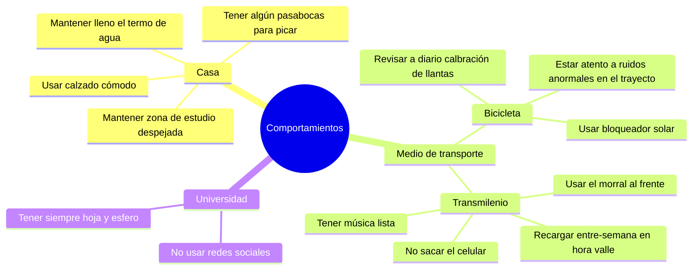

# Desarrollo Taller 2

## Respuesta 1

Reglas básicas sobre comportamiento en distintos lugares.

```mermaid
mindmap
root((Comportamientos))
    Casa
        Mantener zona de estudio despejada
        Usar calzado cómodo
        Tener algún pasabocas para picar
        Mantener lleno el termo de agua
    Medio de transporte
        Bicicleta
            Revisar a diario calbración de llantas
            Estar atento a ruidos anormales en el trayecto
            Usar bloqueador solar
        Transmilenio
            Recargar entre-semana en hora valle
            Usar el morral al frente
            Tener música lista
            No sacar el celular
    Universidad
        No usar redes sociales
        Tener siempre hoja y esfero
```

## Respuesta 3