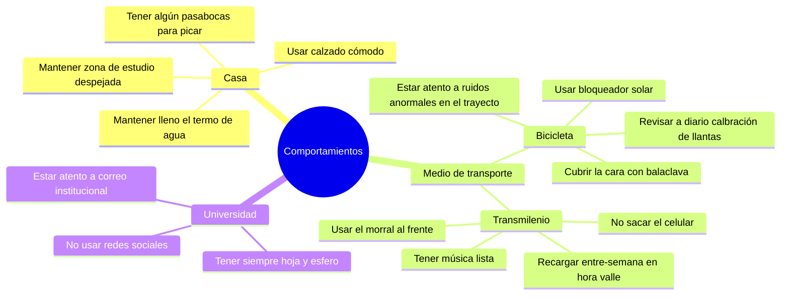

# Desarrollo Taller 2

## Respuesta 1

Reglas básicas sobre comportamiento en distintos lugares.



## Respuesta 3

Para realizar la simulación podemos hacer uso de la herramienta vista en clase NetLogo Web, donde se crea un nuevo modelo con el siguiente código:

```
turtles-own [
  sensor-frontal
  sensor-izquierdo
  sensor-derecho
]

to setup
  clear-all
  
  create-turtles 1 [
    set color green
    set size 2
    setxy 0 0
  ]
  
  create-turtles 4 [
    set color red
    set size 2
    setxy random-xcor random-ycor
    set shape "circle"
  ]
  
  reset-ticks
end

to detectar
  ask turtle 0 [
    set sensor-frontal distance min-one-of other turtles [distance myself]
    
    rt 45
    set sensor-derecho distance min-one-of other turtles [distance myself]
    
    lt 90
    set sensor-izquierdo distance min-one-of other turtles [distance myself]
    
    rt 45
  ]
end

to mover
  ask turtle 0 [
    
    detectar
    
    if sensor-frontal < 3 [
      rt 90
    ]
    
    if sensor-izquierdo < 3 [
      rt 45
    ]
    
    if sensor-derecho < 3 [
      lt 45
    ]
    
    fd 1
  ]
end

to go
  mover
  tick
end
```

Para la interfaz se usa un botón de "setup" o configuración del entorno, y un botón "go", para iniciar el movimiento.

