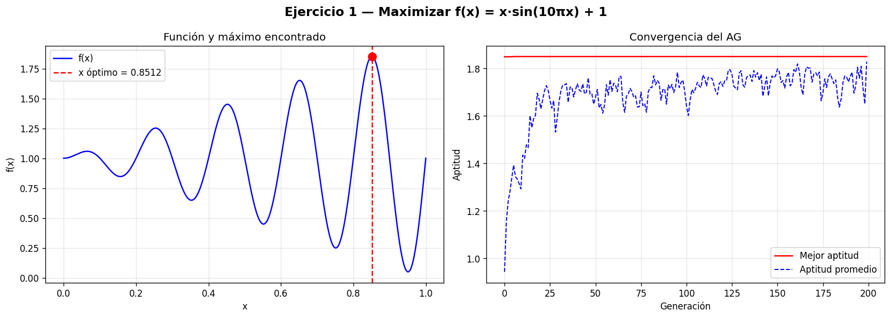
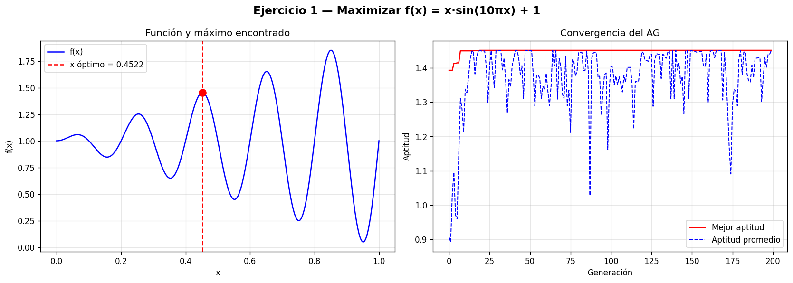
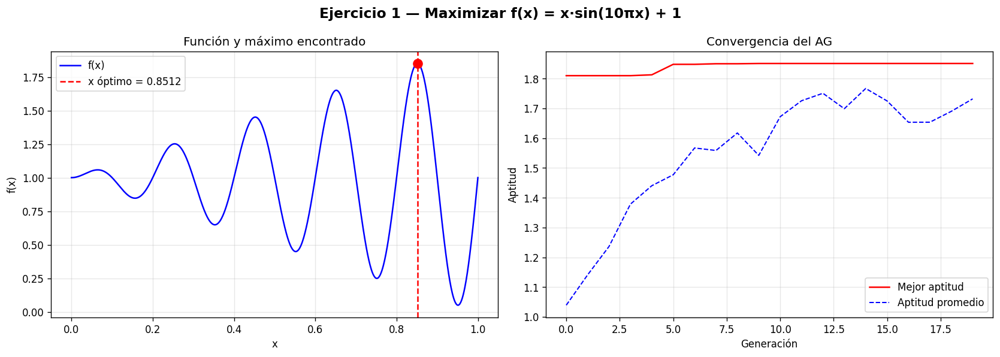
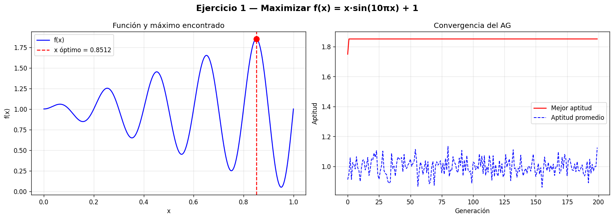
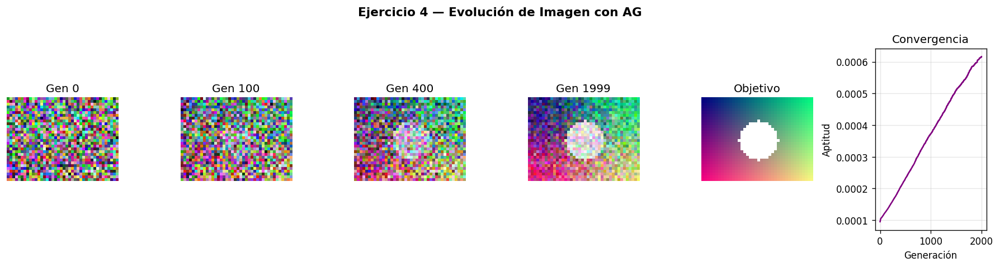
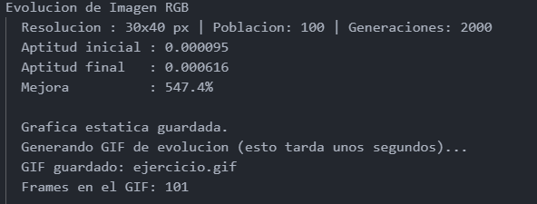
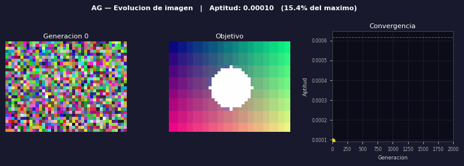
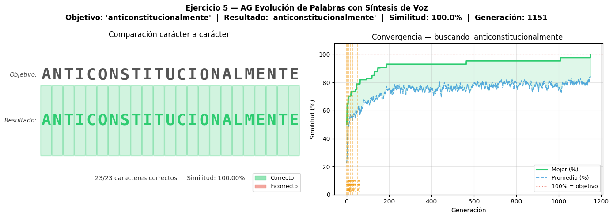

# Ejercicio 1 — Algoritmo genético para maximización de función multimodal

> **Tema:** Algoritmos Genéticos — Semana 3

---

## Problema

Encontrar el **máximo global** de la siguiente función:

$$f(x) = x \cdot \sin(10\pi x) + 1, \quad x \in [0, 1]$$

---

## ¿Por qué es un problema difícil?

Esta función se denomina **multimodal**: tiene múltiples máximos locales (picos) y múltiples mínimos locales (valles). El término $\sin(10\pi x)$ hace que la función oscile completamente **5 veces** dentro del intervalo $[0, 1]$, generando aproximadamente 9 picos distintos, como se puede observar en la gráfica:



Los métodos clásicos de optimización, como el **descenso/ascenso del gradiente**, solo pueden "ver" el terreno inmediato alrededor del punto donde inician. Esto los condena a quedarse atrapados en el primer pico que encuentran, que raramente es el más alto, problema conocido como **convergencia a un óptimo local**.

---

## La analogía de la cordillera en la niebla

Para entender el problema y la solución de forma intuitiva, imagina lo siguiente:

> Es de noche y hay niebla densa. Estás buscando la montaña más alta de toda una cordillera, pero solo puedes sentir el terreno justo debajo de tus pies.

### Método tradicional (Ascenso del gradiente)

Una sola persona sale caminando desde un punto al azar. Solo tiene un altímetro y una regla simple: _"avanza hacia donde el suelo sube, detente cuando el suelo baje"_. Si esa persona arranca cerca de una colina pequeña, subirá hasta su cima y concluirá que esa es la montaña más alta de la cordillera — sin saberlo, se quedó en un **máximo local**.

### Método AG (Algoritmo Genético)

En cambio, **60 personas son lanzadas en paracaídas de forma aleatoria** sobre toda la cordillera. La probabilidad de que al menos una caiga cerca de la montaña más alta es muy elevada. Luego:

- **El cruce** es la comunicación entre ellas: cuando alguien encuentra una zona alta, comparte información con los demás mezclando sus "genes" (bits), atrayendo a la población hacia las mejores zonas.
- **La mutación** hace que no todos los paracaidistas caigan en el mismo sitio, asegurando que se exploren zonas nuevas y no se pierdan posibles picos más altos.

Aunque el ascenso del gradiente puede ser más rápido en cómputo (hay menos cálculos), el AG tiene una ventaja fundamental: **puede encontrar el máximo global** en funciones donde los métodos tradicionales fallan.

---

## Diseño del algoritmo genético

### Representación del cromosoma

Cada individuo (solución candidata) se representa como una **cadena de $L = 22$ bits**:

$$\text{cromosoma} = [b_{21}, b_{20}, \ldots, b_1, b_0], \quad b_i \in \{0, 1\}$$

Ejemplo de un cromosoma:

```
[ 0, 1, 0, 1, 1, 1, 0, 1, 0, 0, 1, 1, 0, 1, 0, 1, 1, 0, 0, 1, 1, 0 ]
```

### Decodificación (genotipo → fenotipo)

Para convertir la cadena binaria en un valor real $x \in [0, 1]$, se usa la siguiente fórmula:

$$x = x_i + (x_f - x_i) \cdot \frac{\sum_{i=0}^{L-1} b_i \cdot 2^{L-1-i}}{2^L - 1}$$

Donde $x_i = 0$ y $x_f = 1$ son los límites del dominio.

#### ¿Por qué $L = 22$ bits?

Con $L$ bits se pueden representar $2^L$ valores distintos en el intervalo $[0, 1]$. La **resolución** (distancia mínima entre dos valores representables) es:

$$\text{Resolución} = \frac{1}{2^L - 1}$$

| Bits ($L$) | Valores posibles |    Resolución    |
| :--------: | :--------------: | :--------------: |
|     8      |       256        |     ≈ 0.0039     |
|     16     |      65 536      |   ≈ 0.0000153    |
|   **22**   |  **4 194 304**   | **≈ 0.00000024** |

Con $L = 22$ se obtiene una resolución de $\approx 2.4 \times 10^{-7}$, suficiente para encontrar el máximo con alta precisión.

---

## Parámetros del algoritmo

| Parámetro                | Variable | Valor usado | Descripción                               |
| :----------------------- | :------: | :---------: | :---------------------------------------- |
| Longitud del cromosoma   |   `L`    |     22      | Número de bits por individuo              |
| Tamaño de la población   |   `K`    |     60      | Número de individuos (paracaidistas)      |
| Número de generaciones   |   `M`    |     200     | Número de iteraciones del ciclo evolutivo |
| Probabilidad de mutación | `P_MUT`  |    0.01     | Probabilidad de que un bit cambie         |
| Límite inferior          |   `XI`   |     0.0     | Inicio del dominio de $x$                 |
| Límite superior          |   `XF`   |     1.0     | Fin del dominio de $x$                    |

---

## Estructura del Código

El programa se divide en **cinco bloques** bien diferenciados:

### Bloque 1 — Librerías

```python
import numpy as np
import matplotlib.pyplot as plt
import math, random
```

Se importan las herramientas para cálculo numérico (`numpy`), graficación (`matplotlib`) y generación de números aleatorios (`random`).

---

### Bloque 2 — Parámetros

Se definen las constantes que controlan el comportamiento del AG. Modificar estos valores permite observar cómo cambia la velocidad de convergencia y la precisión del resultado (ver sección de experimentos).

---

### Bloque 3 — Funciones del AG

#### `f(x)` — Función de aptitud

$$f(x) = x \cdot \sin(10\pi x) + 1$$

Es la función que se desea maximizar. Actúa como el "árbitro": entre más alto sea su valor para un cromosoma, más "apto" se considera ese individuo. En el dominio $[0,1]$ esta función siempre es positiva, lo que facilita su uso directo como aptitud.

---

#### `decodifica(crom)` — Genotipo → Fenotipo

Convierte la cadena de bits a un valor real usando la fórmula de decodificación mostrada anteriormente. Sin esta función el AG no "sabría" qué valor numérico representa cada individuo.

---

#### `genera_poblacion()` — Generación inicial

Crea $K$ cromosomas lanzando una "moneda" bit a bit: cada posición toma el valor 0 o 1 con igual probabilidad. Esto garantiza que la población inicial esté distribuida de manera diversa y aleatoria en todo el dominio $[0, 1]$, equivalente a los paracaidistas cayendo en toda la cordillera.

---

#### `evalua_poblacion(pob)` — Evaluación y ruleta

Para cada cromosoma se calcula:

1. Su valor real $x$ mediante decodificación.
2. Su **aptitud**: $\text{apt}_i = f(x_i)$.
3. Su **probabilidad de selección** (ruleta):

$$P(\text{selección}_i) = \frac{\text{apt}_i}{\sum_{j=1}^{K} \text{apt}_j}$$

Los valores de aptitud nulos o negativos se reemplazan por $10^{-9}$ para evitar errores de división por cero. Así, los individuos más aptos tienen una "tajada" más grande en la ruleta, implementando el principio de **supervivencia del más apto**.

---

#### `seleccion(pob, probs)` — Selección por ruleta

Se gira la ruleta $K$ veces, **con reemplazo**: un mismo individuo puede ser seleccionado más de una vez si su aptitud es alta. Esto simula la reproducción preferencial de los más aptos. El resultado es una nueva lista de $K$ padres listos para cruzarse.

---

#### `cruce(pob)` — Cruce en un punto

Se recorre la población de **dos en dos**. Para cada par de padres:

1. Se elige aleatoriamente un punto de corte $k \in [1, L-1]$.
2. Se crean dos hijos intercambiando los segmentos a partir de ese punto:

$$\text{Hijo}_1 = [p_1^{(1)}, \ldots, p_1^{(k)},\ p_2^{(k+1)}, \ldots, p_2^{(L)}]$$
$$\text{Hijo}_2 = [p_2^{(1)}, \ldots, p_2^{(k)},\ p_1^{(k+1)}, \ldots, p_1^{(L)}]$$

Esto combina información genética de dos individuos exitosos, con la esperanza de que la descendencia herede lo mejor de ambos.

---

#### `mutacion(pob)` — Mutación bit a bit

Se recorre **cada bit de cada cromosoma**. Con probabilidad $p_m$, el bit se invierte ($0 \to 1$ ó $1 \to 0$). Esto introduce variación espontánea que impide que la población entera converja prematuramente hacia una sola zona del espacio de búsqueda.

> **Nota importante:** una probabilidad de mutación muy alta destruye la información acumulada por el cruce. Una muy baja puede causar estancamiento. El valor $p_m = 0.01$ (1 de cada 100 bits muta en promedio) es un punto de partida típico.

---

### Bloque 4 — Ciclo evolutivo principal

```
Iniciar población aleatoria
│
└─ Para cada generación (M veces):
      │
      ├─ 1. Evaluar aptitud de cada individuo
      ├─ 2. Guardar el mejor (elitismo)
      ├─ 3. Seleccionar padres por ruleta
      ├─ 4. Cruzar pares de padres → hijos
      ├─ 5. Mutar hijos
      └─ 6. Nueva población = hijos + élite
```

Se usa **elitismo**: el mejor individuo de cada generación pasa directamente a la siguiente sin modificaciones, garantizando que la aptitud nunca disminuya de generación en generación.

---

### Bloque 5 — Gráficas

Se generan dos gráficas en paralelo:

- **Izquierda:** la función $f(x)$ completa en $[0,1]$, con una línea roja vertical marcando el $x$ óptimo encontrado por el AG.
- **Derecha:** curvas de convergencia — la mejor aptitud y la aptitud promedio de la población a lo largo de las generaciones.

---

## Resultados y Experimentos

El valor teórico del máximo global es:

$$x^* \approx 0.8521, \quad f(x^*) \approx 1.8504$$

### Configuración base

| `K` | `M` | `P_MUT` | $x$ encontrado | $f(x)$  |
| :-: | :-: | :-----: | :------------: | :-----: |
| 60  | 200 |  0.01   |    0.85119     | 1.85059 |

### Experimento 1 — Reducir la población

Cambia `K = 70` → `K = 10` y observa cómo con pocos "paracaidistas" el AG puede quedarse en un pico incorrecto. La diversidad inicial es crucial.


### Experimento 2 — Pocas generaciones

Cambia `M = 200` → `M = 20` y observa que la curva de convergencia no alcanza su tope: el AG necesita más tiempo para afinar la solución.


### Experimento 3 — Mutación muy alta

Cambia `P_MUT = 0.01` → `P_MUT = 0.3` y observa que la aptitud promedio oscila sin converger: mutar demasiado es equivalente a una búsqueda casi aleatoria, destruyendo el conocimiento acumulado.


---

## Cómo ejecutar

```bash
# Instalar dependencias
pip install numpy matplotlib

# Ejecutar
python problem-one.py
```

---

## Conceptos clave

| Término                | Significado en este ejercicio                             |
| :--------------------- | :-------------------------------------------------------- |
| **Cromosoma**          | Cadena de 22 bits que representa un valor $x \in [0,1]$   |
| **Gen**                | Cada bit individual del cromosoma                         |
| **Aptitud**            | El valor de $f(x)$ para ese individuo — más alto es mejor |
| **Ruleta**             | Mecanismo de selección proporcional a la aptitud          |
| **Cruce**              | Intercambio de segmentos de bits entre dos padres         |
| **Mutación**           | Inversión aleatoria de un bit para explorar zonas nuevas  |
| **Elitismo**           | Garantizar que el mejor individuo siempre sobreviva       |
| **Función multimodal** | Función con múltiples máximos y mínimos locales           |
| **Óptimo local**       | Un pico que no es el más alto de la función               |
| **Óptimo global**      | El pico más alto de toda la función — lo que buscamos     |

# Ejercicio 4 — Algoritmo Genético para Evolución de Imágenes RGB

> **Tema:** Algoritmos Genéticos — Semana 3

---

## Problema

Partiendo únicamente de **ruido blanco** (píxeles de colores completamente aleatorios, como una televisión sin señal), hacer que un Algoritmo Genético aprenda a replicar una imagen objetivo **sin recibir ninguna instrucción explícita** sobre qué colores pintar ni dónde hacerlo.
La imagen objetivo es un gradiente de color con un círculo blanco en el centro:

$$\text{píxel}(i, j) = \left(\lfloor 255 \cdot \frac{i}{H} \rfloor,\ \lfloor 255 \cdot \frac{j}{W} \rfloor,\ 128\right), \quad \text{con círculo blanco si } (i - c_x)^2 + (j - c_y)^2 \leq r^2$$

---

## Lo principal: Auto-organización

Lo más importante de este ejercicio es demostrar **auto-organización**: sin recibir indicaciones de nadie, sin conocer las reglas del gradiente ni la posición del círculo, el AG aprende a pintar la imagen a través de pura **selección natural**. Nadie le dice _"ese píxel debe ser verde"_, simplemente los individuos que se equivocan menos sobreviven y se reproducen.

---

## ¿Por qué es necesario un AG aquí?

### 1. Espacio de búsqueda masivo

Cada imagen tiene una resolución de $30 \times 40$ píxeles. Cada píxel almacena tres canales de color (RGB), y cada canal puede tomar cualquier valor entre 0 y 255. El número total de imágenes posibles es:

$$\text{Combinaciones} = 256^{30 \times 40 \times 3} = 256^{3600}$$

Este número es tan grande que resulta imposible verificar todas las opciones, incluso con la computadora más potente del mundo. Para tener una referencia, el número de átomos en el universo observable es aproximadamente $10^{80}$, un número infinitamente menor.

### 2. No existe una fórmula directa

No hay ninguna ecuación matemática simple que indique exactamente cómo mover cada bit de cada píxel para llegar a la imagen objetivo. El AG trabaja con **prueba, error y selección**: genera candidatos, mide qué tan cerca están del objetivo, y favorece la reproducción de los mejores.

---

## Comparación con otros métodos

| Método                                        | ¿Funciona aquí? | ¿Por qué?                                                                                                                                                                                     |
| :-------------------------------------------- | :-------------: | :-------------------------------------------------------------------------------------------------------------------------------------------------------------------------------------------- |
| **Fuerza bruta** (aleatoria)                  |       No        | Generar imágenes al azar hasta dar con la correcta podría tomar millones de años. La probabilidad de acertar es $1 / 256^{3600}$                                                              |
| **Descenso del gradiente**                    |   Si, pero...   | Requiere que la función de error sea diferenciable y derivable respecto a cada píxel. Es la base del Deep Learning, pero demanda más hardware y no siempre converge en este tipo de problemas |
| **Métodos heurísticos** (programación manual) |   Si, pero...   | Se podría indicar con código dónde y de qué color pintar cada zona, pero eso ya no es aprendizaje algorítmico sino programación directa: no generaliza a imágenes desconocidas                |
| **Algoritmo Genético**                        |       Si        | Explora muchas soluciones en paralelo, no necesita derivadas, y mejora de forma progresiva guiado únicamente por la función de aptitud                                                        |

---

## Parámetros del algoritmo

| Parámetro                | Variable | Valor | Descripción                                          |
| :----------------------- | :------: | :---: | :--------------------------------------------------- |
| Alto de la imagen        |   `H`    |  30   | Número de filas de píxeles                           |
| Ancho de la imagen       |   `W`    |  40   | Número de columnas de píxeles                        |
| Tamaño de la población   |   `K`    |  30   | Número de imágenes candidatas por generación         |
| Número de generaciones   |   `M`    |  100  | Iteraciones del ciclo evolutivo                      |
| Probabilidad de mutación | `P_MUT`  | 0.005 | Probabilidad de que un canal de un píxel mute (0.5%) |

---

## Proceso del algoritmo paso a paso

### Paso 1 — Población inicial (ruido blanco)

Se generan $K = 30$ imágenes completamente aleatorias. Cada cromosoma es una matriz de $30 \times 40 \times 3$ valores enteros entre 0 y 255, generados sin ningún patrón:

```python
def genera_cromosoma():
    return np.random.randint(0, 256, (H, W, 3), dtype=np.uint8)
```

Visualmente estas imágenes se ven como **estática de televisión**: ninguna tiene parecido alguno con el objetivo.

---

### Paso 2 — Evaluación de aptitud

El algoritmo compara cada imagen candidata con la imagen objetivo píxel a píxel. Se calcula el **Error Cuadrático Medio (MSE)** entre los colores RGB:

$$\text{MSE} = \frac{1}{H \cdot W \cdot 3} \sum_{i=1}^{H} \sum_{j=1}^{W} \sum_{c \in \{R,G,B\}} \left( \text{crom}_{i,j,c} - \text{obj}_{i,j,c} \right)^2$$

Como se busca _maximizar_ la aptitud (mayor = mejor), se convierte el MSE en aptitud con:

$$\text{aptitud} = \frac{1}{1 + \text{MSE}}$$

Así, cuando una imagen es idéntica al objetivo ($\text{MSE} = 0$), la aptitud es **1.0** (máximo). Cuando los colores son muy distintos, el MSE es alto y la aptitud tiende a **0**. Las imágenes cuyos píxeles coinciden mejor en color y posición con el objetivo son las que sobreviven.

---

### Paso 3 — Selección por torneo

A diferencia de la selección por ruleta (donde la probabilidad es proporcional a la aptitud global), aquí se usa **selección por torneo**:

1. Se escogen **3 individuos al azar** de la población.
2. El que tenga la **mayor aptitud** de los tres gana el torneo y se convierte en padre.
3. Este proceso se repite $K$ veces para llenar la siguiente generación de padres.

```python
def seleccion_torneo(pob, apts):
    nueva = []
    for _ in range(K):
        cands   = random.sample(range(K), 3)
        ganador = max(cands, key=lambda i: apts[i])
        nueva.append(pob[ganador].copy())
    return nueva
```

**¿Por qué torneo y no ruleta?** En la ruleta, si un individuo tiene una aptitud muchísimo más alta que los demás, acapara casi toda la probabilidad y la diversidad de la población colapsa rápidamente. El torneo **controla la presión de selección**: aunque los mejores ganan más frecuentemente, los intermedios también tienen oportunidad de competir y ganar, lo que mantiene mayor variedad genética y evita la convergencia prematura.

---

### Paso 4 — Cruce horizontal

Se toman los padres **de dos en dos** y se cruzan cortando la imagen a lo largo de una **fila horizontal** elegida al azar. El punto de corte $pt$ se elige entre la fila 1 y la fila $H-1$:

```
Padre 1 (filas 0 a pt-1)  +  Padre 2 (filas pt a H-1)  →  Hijo 1
Padre 2 (filas 0 a pt-1)  +  Padre 1 (filas pt a H-1)  →  Hijo 2
```

```python
def cruce(pob):
    hijos = []
    for i in range(0, K, 2):
        pt = random.randint(1, H - 1)
        h1 = np.vstack([pob[i][:pt],   pob[i+1][pt:]])
        h2 = np.vstack([pob[i+1][:pt], pob[i][pt:]])
        hijos += [h1, h2]
    return hijos
```

Esto permite que un hijo **herede características visuales completas** de cada padre: por ejemplo, si el Padre 1 logró pintar bien el gradiente en la parte superior y el Padre 2 logró el círculo en la parte inferior, el Hijo 1 puede combinar ambos aciertos en una sola imagen.

---

### Paso 5 — Mutación de píxeles

Con una probabilidad de $p_m = 0.005$ (es decir, **0.5% por canal por píxel**), un canal de color se reemplaza por un valor completamente nuevo al azar:

```python
def mutacion(pob):
    for crom in pob:
        mascara       = np.random.random((H, W, 3)) < P_MUT
        ruido         = np.random.randint(0, 256, (H, W, 3))
        crom[mascara] = ruido.astype(np.uint8)[mascara]
    return pob
```

La mutación cumple dos funciones clave:

- **Exploración:** introduce valores de color que ningún padre tenía, permitiendo descubrir combinaciones no exploradas hasta ese momento.
- **Prevención de estancamiento:** sin mutación, la población entera terminaría siendo copias casi idénticas del mejor individuo, y el algoritmo dejaría de mejorar.

> **¿Por qué 0.5% y no más?** Una probabilidad alta de mutación (por ejemplo, 10%) haría que los hijos fueran esencialmente aleatorios, destruyendo la información que el cruce acababa de combinar. El valor de 0.5% asegura que la mayoría de los píxeles se conserven intactos entre generaciones.

---

### Paso 6 — Elitismo

Antes de aplicar el cruce y la mutación, **el mejor individuo de la generación actual se guarda** y se inserta directamente en la siguiente generación sin ninguna modificación:

```python
elite  = pob[idx].copy()
# ... cruce y mutación ...
pob[0] = elite   # el élite sobrevive intacto
```

Esto garantiza dos cosas:

1. La **aptitud nunca disminuye** de una generación a la siguiente: si todos los hijos son peores que el padre élite, el élite sobrevive de todos modos.
2. Se protege el mejor resultado acumulado de la destrucción accidental por mutación.

---

## Ciclo completo

```
Generar K imágenes aleatorias (ruido blanco)
│
└─ Para cada generación (M veces):
      │
      ├─ 1. Calcular MSE y aptitud de cada imagen
      ├─ 2. Guardar el mejor individuo (élite)
      ├─ 3. Selección por torneo → lista de K padres
      ├─ 4. Cruce horizontal por pares → K hijos
      ├─ 5. Mutación aleatoria de píxeles (0.5%)
      └─ 6. Nueva población = hijos + élite en posición 0
```

---

## Resultados

| Métrica                |  Valor 1   |  Valor 2   |
| :--------------------- | :--------: | :--------: |
| Resolución             | 30 × 40 px | 30 × 40 px |
| Aptitud generación 0   | ≈ 0.000095 | ≈ 0.000095 |
| Aptitud generación 100 | ≈ 0.000121 | ≈ 0.000616 |
| Mejora total           |  ≈ 27.7%   |   547.4%   |

La convergencia de la imagen se puede apreciar en las gráficas generadas, que muestran la evolución visual en las generaciones 0, 100, 400 y 2000, junto con la imagen objetivo y la curva de aptitud.




---

## GIF de evolución

El archivo `ejercicio.gif` muestra el proceso generación a generación:

- **Panel izquierdo:** imagen en evolución. El borde cambia de rojo (aptitud baja) a verde (aptitud alta).
- **Panel central:** imagen objetivo (fija como referencia).
- **Panel derecho:** curva de convergencia en tiempo real, con un punto amarillo que indica la generación actual.



---

## ¿Qué nos permite entender este ejercicio?

Este ejercicio demuestra que los Algoritmos Genéticos son capaces de resolver problemas de búsqueda en espacios de dimensión extremadamente alta sin necesidad de derivadas, sin conocimiento explícito del dominio y sin programación de reglas específicas. La inteligencia emerge únicamente de tres principios simples: **selección, cruce y mutación**. Es exactamente el mismo mecanismo que, a escala biológica, produjo la enorme diversidad de formas de vida en la Tierra.

---

## Cómo ejecutar

```bash
# Instalar dependencias
pip install numpy matplotlib pillow

# Ejecutar (genera ejercicio4.png y ejercicio4_evolucion.gif)
python problem-four.py
```

---

## Conceptos clave

| Término                  | Significado en este ejercicio                                            |
| :----------------------- | :----------------------------------------------------------------------- |
| **Cromosoma**            | Una imagen completa de $30 \times 40 \times 3$ valores RGB               |
| **Gen**                  | El valor de un canal de color de un único píxel (0–255)                  |
| **Genotipo**             | La matriz numérica interna que representa la imagen                      |
| **Fenotipo**             | La imagen visual que se puede ver al renderizar el cromosoma             |
| **Aptitud**              | $1 / (1 + \text{MSE})$: qué tan parecida es la imagen al objetivo        |
| **MSE**                  | Error Cuadrático Medio: diferencia promedio al cuadrado entre píxeles    |
| **Selección por torneo** | Elegir el mejor de 3 candidatos aleatorios como padre                    |
| **Cruce horizontal**     | Combinar la mitad superior de un padre con la mitad inferior del otro    |
| **Mutación**             | Cambiar un canal de color a un valor aleatorio con probabilidad 0.5%     |
| **Elitismo**             | Garantizar que el mejor individuo de cada generación siempre sobreviva   |
| **Auto-organización**    | El patrón visual emerge sin instrucciones explícitas, solo por selección |
| **Ruido blanco**         | Imagen inicial completamente aleatoria (punto de partida del AG)         |

# Ejercicio 5 — Algoritmo genético para evolución de palabras con síntesis de voz

> **Tema:** Algoritmos Genéticos — Semana 3

---

## Problema

Partiendo de una población de **77 palabras completamente aleatorias** en español, hacer que un Algoritmo Genético evolucione esa población hasta encontrar la palabra objetivo `"anticonstitucionalmente"` — la palabra más larga reconocida por la Real Academia Española con 22 caracteres. Cada etapa clave del proceso se **escucha por el parlante del computador** mediante síntesis de voz real (gTTS), permitiendo percibir auditivamente cómo las palabras mejoran generación tras generación.

---

## Lo principal: Búsqueda en espacio de lenguaje

Lo más importante de este ejercicio es demostrar que los AG pueden operar sobre **representaciones no numéricas**: cadenas de texto del lenguaje natural. A diferencia de los ejercicios numéricos, aquí no hay ecuaciones que derivar ni píxeles que comparar canal a canal. El algoritmo debe aprender a construir una palabra específica de 22 caracteres partiendo únicamente de palabras cortas y aleatorias, guiado solo por una medida de similitud de caracteres.

El proceso es análogo al **juego del teléfono roto al revés**: en vez de que el mensaje se degrade generación a generación, la evolución lo _mejora_ hasta llegar exactamente al original.

Elegir `"anticonstitucionalmente"` como objetivo es deliberado: es una palabra tan larga y específica que ninguna palabra del vocabulario común se le parece, lo que obliga al AG a construirla carácter a carácter a través de cruces y mutaciones sucesivas — haciendo visible todo el poder del algoritmo.

---

## ¿Por qué es necesario un AG aquí?

### 1. Espacio de búsqueda enorme

Si se considera el vocabulario de las 10 000 palabras más comunes del español, el número de combinaciones posibles para una población de 77 palabras es:

$$\text{Combinaciones} = 10000^{77} = 10^{308}$$

Este número supera en muchos órdenes de magnitud el número de átomos en el universo observable ($\approx 10^{80}$). Verificar todas las combinaciones posibles es computacionalmente imposible. El AG no busca en todas partes: **explora de forma inteligente**, concentrando la búsqueda en las zonas más prometedoras del espacio.

### 2. No existe una ruta directa

No hay ninguna operación matemática que transforme la palabra `"tierra"` en `"anticonstitucionalmente"` en un solo paso. El AG trabaja a nivel de **caracteres individuales**, combinando fragmentos de palabras que se parecen al objetivo y ajustando letra a letra a través de la mutación, para producir candidatos cada vez mejores.

---

## Comparación con otros métodos

| Método                                 | ¿Funciona aquí? | ¿Por qué?                                                                                                                                        |
| :------------------------------------- | :-------------: | :----------------------------------------------------------------------------------------------------------------------------------------------- |
| **Fuerza bruta** (aleatoria)           |       No        | La probabilidad de generar `"anticonstitucionalmente"` al azar es $1/26^{22} \approx 10^{-31}$. Podría tomar más tiempo que la edad del universo |
| **Búsqueda exhaustiva**                |       No        | Revisar todas las cadenas posibles de 22 caracteres es inviable incluso con supercomputadoras                                                    |
| **Métodos heurísticos** (reglas fijas) |       No        | Se podría programar explícitamente "agrega esta letra aquí", pero eso no es aprendizaje: es programación directa y no generaliza                 |
| **Algoritmo Genético**                 |       Sí        | Combina fragmentos fonéticos exitosos, ajusta caracteres individuales y converge hacia el objetivo en pocas generaciones                         |

---

## Parámetros del algoritmo

| Parámetro                |      Variable      |            Valor            | Descripción                                                 |
| :----------------------- | :----------------: | :-------------------------: | :---------------------------------------------------------- |
| Palabra objetivo         | `palabra_objetivo` | `"anticonstitucionalmente"` | La palabra de 22 caracteres que el AG debe construir        |
| Tamaño de la población   |   `n_poblacion`    |             77              | Número de palabras candidatas por generación                |
| Número de generaciones   |   `generaciones`   |            2000             | Iteraciones máximas del ciclo evolutivo                     |
| Probabilidad de mutación |  `prob_mutacion`   |            0.59             | Probabilidad de aplicar una mutación de carácter            |
| Vocabulario              |   `VOCABULARIO`    |         top 10 000          | Palabras reales del español sin frases (fuente: `wordfreq`) |

> **Nota sobre los parámetros:** La palabra objetivo tiene 22 caracteres, lo que hace el problema mucho más difícil que buscar `"perro"`. Se aumentó la población a 77 individuos para mantener diversidad genética suficiente, las generaciones a 2000 para dar tiempo de convergencia, y la mutación a 0.59 para asegurar exploración activa del espacio de caracteres. Con `prob_mutacion = 0.001` el AG se estancaría desde las primeras generaciones sin poder construir la palabra larga carácter a carácter.

---

## Proceso del algoritmo paso a paso

### Paso 1 — Población inicial: 77 palabras aleatorias

Se generan 77 palabras reales del español usando el vocabulario de frecuencia de `wordfreq`, específicamente `top_n_list` que retorna palabras individuales (no frases). Solo se aceptan palabras que contengan exclusivamente letras (`isalpha()`) y que no sean iguales al objetivo:

```python
VOCABULARIO = [p for p in top_n_list('es', 10000) if p.isalpha() and p != palabra_objetivo]

def pob_init():
    return random.sample(VOCABULARIO, n_poblacion)
```

> **¿Por qué `top_n_list` y no `random_words`?** La función `random_words` de `wordfreq` puede retornar frases completas como `"pocas bosque ecuador propia mapa"` en vez de palabras sueltas, lo que rompe el AG porque el cromosoma dejaría de ser una sola palabra. `top_n_list('es', 10000)` retorna una lista limpia de las 10 000 palabras individuales más frecuentes del español.

En este punto se reproduce el audio de la población completa, permitiendo escuchar el "ruido" inicial — 77 palabras sin ninguna relación con `"anticonstitucionalmente"`:

```
Muestra: ['tierra', 'carro', 'querer', 'mesa', 'azul', 'padre', 'rio', 'luna'] ...
```

---

### Paso 2 — Evaluación de aptitud

Se mide qué tan parecida es cada palabra candidata a `"anticonstitucionalmente"` usando `difflib.SequenceMatcher`, que calcula la similitud basada en las **subsecuencias comunes más largas** entre dos cadenas:

$$\text{aptitud}(p,\ o) = \text{SequenceMatcher}(\text{None},\ p,\ o).\text{ratio}() \in [0,\ 1]$$

La fórmula interna de `SequenceMatcher` es:

$$\text{ratio} = \frac{2 \cdot M}{T}$$

donde $M$ es el número de caracteres que coinciden en la subsecuencia común más larga y $T$ es el total de caracteres en ambas cadenas. Esto significa que la similitud tiene en cuenta tanto el contenido de los caracteres como su orden relativo.

Ejemplos concretos con objetivo `"anticonstitucionalmente"`:

|      Palabra candidata      | Similitud | Razón                                      |
| :-------------------------: | :-------: | :----------------------------------------- |
|          `"luna"`           |    ~4%    | Sin caracteres comunes en posición similar |
|          `"mente"`          |   ~35%    | Comparte el sufijo `-mente`                |
|      `"constitucion"`       |   ~65%    | Comparte el núcleo de la palabra           |
| `"anticonstitucionalmente"` |   100%    | Palabras idénticas                         |

---

### Paso 3 — Selección por ruleta proporcional a aptitud

Se seleccionan dos padres para cada nuevo hijo usando una **ruleta ponderada**: las palabras con mayor similitud al objetivo tienen mayor probabilidad de ser elegidas:

```python
def seleccion(palabras):
    pesos = [max(aptitud(p, palabra_objetivo), 0.001) for p in palabras]
    return random.choices(palabras, weights=pesos, k=2)
```

El valor mínimo de `0.001` evita que ninguna palabra tenga peso cero, lo que causaría que `random.choices` falle. Si una palabra tiene aptitud `0.0`, aún así puede ser elegida con probabilidad muy baja, manteniendo la posibilidad de que explore combinaciones inesperadas.

---

### Paso 4 — Cruce por punto aleatorio

Se combinan los dos padres seleccionados cortando sus cadenas de caracteres en un **punto aleatorio** dentro del rango de la palabra más corta. Esta es una mejora respecto al cruce por punto fijo (la mitad), ya que permite mayor variedad en los fragmentos heredados:

$$k = \text{randint}(1,\ \min(\text{len}(p_1),\ \text{len}(p_2)))$$

$$\text{hijo} = p_1[0:k] + p_2[k:]$$

```python
def cruce(padre1, padre2):
    punto = random.randint(1, min(len(padre1), len(padre2)))
    hijo  = padre1[:punto] + padre2[punto:]
    return hijo
```

Ejemplo con objetivo `"anticonstitucionalmente"`:

```
padre1 = "anticipacion"    →  "antici"         (punto k=6)
padre2 = "constitucion"    →  "stitucion"
hijo   = "antistitucion"    →  no perfecto, pero hereda "anti-" + partes de "-stitucion"
```

El cruce permite combinar fragmentos fonéticos exitosos de dos padres. Si un padre logró capturar el prefijo `"anti-"` y otro tiene el sufijo `"-mente"`, el hijo puede heredar ambos fragmentos en una sola palabra.

---

### Paso 5 — Mutación de ajuste fino de caracteres

Esta es la función más importante y diferente respecto a versiones anteriores del ejercicio. En vez de reemplazar la **palabra completa** por otra aleatoria del vocabulario, la mutación ahora opera a nivel de **caracteres individuales**, realizando uno de tres cambios al azar:

```python
def mutacion(prob_mut, palabra):
    if random.random() <= prob_mut:
        letras = "abcdefghijklmnopqrstuvwxyz"
        lista_palabra = list(palabra)
        indice = random.randint(0, len(lista_palabra) - 1)

        tipo = random.random()
        if tipo < 0.33:                          # Cambiar una letra
            lista_palabra[indice] = random.choice(letras)
        elif tipo < 0.66 and len(lista_palabra) > 1:  # Borrar una letra
            lista_palabra.pop(indice)
        else:                                    # Añadir una letra
            lista_palabra.insert(indice, random.choice(letras))

        return "".join(lista_palabra)
    return palabra
```

Los tres tipos de mutación y su propósito:

| Tipo            | Probabilidad | Efecto                                   | Ejemplo                          |
| :-------------- | :----------: | :--------------------------------------- | :------------------------------- |
| **Sustitución** |     33%      | Cambia un carácter por otro aleatorio    | `"antis..."` → `"antio..."`      |
| **Eliminación** |     33%      | Borra un carácter en posición aleatoria  | `"anticoo..."` → `"antico..."`   |
| **Inserción**   |     33%      | Agrega un carácter en posición aleatoria | `"anticon..."` → `"anticons..."` |

> **¿Por qué caracteres y no palabras?** La palabra objetivo tiene 22 caracteres. Ninguna palabra del vocabulario español ordinario se le parece lo suficiente como para que un reemplazo completo mejore la aptitud significativamente. La mutación por caracteres permite **ajuste fino**: si el AG ya llegó a `"anticonstitucionalment"` (21 caracteres), una inserción de `"e"` al final lo lleva directamente al 100%. Eso es imposible si la mutación reemplaza toda la palabra.

---

### Paso 6 — Elitismo

Los **5 mejores individuos** de cada generación pasan directamente a la siguiente sin ninguna modificación:

```python
nueva_poblacion = list(poblacion[:5])   # top 5 sobreviven intactos
while len(nueva_poblacion) < n_poblacion:
    padres = seleccion(poblacion)
    hijo   = cruce(padres[0], padres[1])
    hijo   = mutacion(prob_mutacion, hijo)
    nueva_poblacion.append(hijo)
```

Esto garantiza que la similitud con el objetivo **nunca disminuye** de una generación a la siguiente. La construcción de una palabra de 22 caracteres es un proceso acumulativo: cada carácter correcto conquistado debe protegerse de la destrucción aleatoria de generaciones futuras.

---

### Paso 7 — Síntesis de voz (gTTS)

En las generaciones 0, 5, 10, 20, 30 y 50 se sintetiza la mejor palabra de ese momento usando **Google Text-to-Speech** y se reproduce directamente en el entorno de Colab:

```python
def voz_palabra(palabra, nombre_archivo="palabra.mp3"):
    tts = gTTS(text=palabra, lang="es")
    tts.save(nombre_archivo)
    display(Audio(nombre_archivo))
```

Al inicio se escucha algo completamente diferente a `"anticonstitucionalmente"`. En las generaciones intermedias, la pronunciación empieza a contener sílabas reconocibles de la palabra objetivo. Al final, se escucha exactamente la palabra completa.

Adicionalmente, al inicio y al final se reproduce **toda la población** (77 palabras en secuencia), lo que permite percibir auditivamente la diferencia entre el ruido inicial y la población evolucionada:

```python
def voz(poblacion, nombre_archivo="voz.mp3"):
    texto = " ".join(poblacion)   # todas las palabras en secuencia
    tts   = gTTS(text=texto, lang="es")
    tts.save(nombre_archivo)
    display(Audio(nombre_archivo))
```

---

## Ciclo completo

```
Generar 77 palabras aleatorias del top 10 000 del español
│
└─ Para cada generación (hasta 2000):
      │
      ├─ 1. Ordenar población por similitud con el objetivo
      ├─ 2. Guardar los 5 mejores (elitismo)
      ├─ 3. Reproducir audio si es generación clave (0, 5, 10, 20, 30, 50)
      ├─ 4. Verificar si similitud = 100% → detener
      ├─ 5. Selección por ruleta ponderada → 2 padres
      ├─ 6. Cruce por punto aleatorio → fragmentos de ambos padres
      ├─ 7. Mutación de carácter: sustituir / borrar / insertar (prob 0.59)
      └─ 8. Nueva generación = 5 élite + 72 hijos
```

---

## Resultados

La trayectoria de convergencia típica muestra tres fases claras:

**Fase 1 — Exploración (gen 0–50):** La aptitud sube rápido desde ~5% porque cualquier palabra que comparta algunas letras con `"anticonstitucionalmente"` ya supera a las palabras cortas y genéricas del inicio.

**Fase 2 — Refinamiento (gen 50–500):** El AG empieza a construir prefijos y sufijos reconocibles (`"anti-"`, `"-mente"`, `"-cion-"`). La mejora es más lenta porque cada carácter adicional correcto requiere combinaciones específicas.

**Fase 3 — Ajuste fino (gen 500–2000):** Los últimos caracteres son los más difíciles. La mutación por inserción y eliminación es crítica aquí para ajustar la longitud exacta de la palabra.



### Proceso de evolución

A continuación, se presentan 8 muestras de audio que muestran individuos de las primeras etapas o diversas variaciones de la población:

| Muestra        | Enlace al Audio                                   |
| :------------- | :------------------------------------------------ |
| **Intento 01** | [▶ Escuchar audio_1.mp3](graphics/t5/audio_1.mp3) |
| **Intento 02** | [▶ Escuchar audio_2.mp3](graphics/t5/audio_2.mp3) |
| **Intento 03** | [▶ Escuchar audio_3.mp3](graphics/t5/audio_3.mp3) |
| **Intento 04** | [▶ Escuchar audio_4.mp3](graphics/t5/audio_4.mp3) |
| **Intento 05** | [▶ Escuchar audio_5.mp3](graphics/t5/audio_5.mp3) |
| **Intento 06** | [▶ Escuchar audio_6.mp3](graphics/t5/audio_6.mp3) |
| **Intento 07** | [▶ Escuchar audio_7.mp3](graphics/t5/audio_7.mp3) |
| **Intento 08** | [▶ Escuchar audio_8.mp3](graphics/t5/audio_8.mp3) |

---

### Resultados finales

| Categoría              | Descripción                                                                             | Enlace                                              |
| :--------------------- | :-------------------------------------------------------------------------------------- | :-------------------------------------------------- |
| **Palabra Original**   | El objetivo final (Ground Truth) que el algoritmo buscaba replicar.                     | [Escuchar resultado.mp3](graphics/t5/resultado.mp3) |
| **Evolución Completa** | Compilación que muestra el progreso desde el ruido inicial hasta la convergencia final. | [Escuchar audio.mp3](graphics/t5/audio.mp3)         |

---

## Audio generado

| Archivo                                                   | Contenido                                  | Cuándo se genera           |
| :-------------------------------------------------------- | :----------------------------------------- | :------------------------- |
| [Escuchar palabra inicial.mp3](graphics/t5/resultado.mp3) | `"anticonstitucionalmente"` leída por gTTS | Al inicio, como referencia |
| [Escuchar audio.mp3](graphics/t5/audio_1.mp3)             | Las 77 palabras aleatorias en secuencia    | Al inicio del ciclo        |
| [Escuchar audio_1.mp3](graphics/t5/audio_3.mp3)           | Mejor palabra de la generación 0           | Automáticamente            |
| [Escuchar audio_2.mp3](graphics/t5/audio_4.mp3)           | Mejor palabra de la generación 5           | Automáticamente            |
| [Escuchar audio_3.mp3](graphics/t5/audio_5.mp3)           | Mejor palabra de la generación 10          | Automáticamente            |
| [Escuchar audio_4.mp3](graphics/t5/audio_6.mp3)           | Mejor palabra de la generación 20          | Automáticamente            |
| [Escuchar audio_5.mp3](graphics/t5/audio_7.mp3)           | Mejor palabra de la generación 30          | Automáticamente            |
| [Escuchar audio_6.mp3](graphics/t5/audio_8.mp3)           | Mejor palabra de la generación 50          | Automáticamente            |
| [Escuchar audio_7.mp3](graphics/t5/audio.mp3)             | Las 77 palabras de la última generación    | Al final del ciclo         |
| [Escuchar palabra final.mp3](graphics/t5/resultado.mp3)   | La mejor palabra encontrada                | Al final del ciclo         |

Escuchando los archivos en orden cronológico se puede percibir auditivamente toda la trayectoria evolutiva: desde palabras sin relación hasta llegar a `"anticonstitucionalmente"` o una aproximación muy cercana.

---

## ¿Qué nos permite entender este ejercicio?

Este ejercicio demuestra que los Algoritmos Genéticos pueden operar sobre **estructuras de lenguaje natural** sin ningún conocimiento lingüístico previo. El AG no sabe qué es una vocal, no conoce reglas gramaticales, no entiende el significado de ninguna palabra. Sin embargo, guiado únicamente por la función de similitud de caracteres, logra construir una palabra de 22 caracteres desde el ruido.

La elección de `"anticonstitucionalmente"` como objetivo es especialmente ilustrativa: demuestra que el AG puede encontrar cadenas muy largas y específicas mediante la acumulación progresiva de fragmentos correctos, exactamente como la evolución biológica construye estructuras complejas (un ojo, un ala) mediante la acumulación de mutaciones beneficiosas a lo largo del tiempo.

Esta misma lógica tiene aplicaciones reales en síntesis de voz dañada, recuperación de palabras en señales de audio degradadas, generación automática de nombres con sonoridad similar a un referente dado, y descifrado de códigos lingüísticos.

---

## Cómo ejecutar

```python
# Este ejercicio requiere internet (gTTS usa la API de Google Text-to-Speech)
# Se recomienda ejecutar en Google Colab

# Celda 1: instalar dependencias
!pip install gtts wordfreq

# Celda 2: ejecutar el algoritmo
# (pegar el código completo del archivo ejercicio5.py)
```

> La palabra `"anticonstitucionalmente"` es larga y puede tardar varios minutos en encontrarse dependiendo de la semilla aleatoria. Si se desea una demostración más rápida, se puede cambiar `palabra_objetivo = "perro"` y reducir `generaciones = 120`.

---

## Conceptos clave

| Término                       | Significado en este ejercicio                                                                            |
| :---------------------------- | :------------------------------------------------------------------------------------------------------- |
| **Cromosoma**                 | Una palabra completa (cadena de caracteres de longitud variable)                                         |
| **Gen**                       | Cada carácter individual de la palabra (`'a'`, `'n'`, `'t'`, ...)                                        |
| **Población**                 | Conjunto de 77 palabras candidatas en cada generación                                                    |
| **Aptitud**                   | `SequenceMatcher.ratio()`: similitud de caracteres con el objetivo, en [0, 1]                            |
| **Selección por ruleta**      | Las palabras más similares tienen mayor probabilidad de ser elegidas como padres                         |
| **Cruce por punto aleatorio** | Primera parte de un padre + segunda parte del otro, cortando en posición aleatoria                       |
| **Mutación por sustitución**  | Cambia un carácter en posición aleatoria por otra letra del abecedario                                   |
| **Mutación por eliminación**  | Borra un carácter en posición aleatoria (reduce longitud en 1)                                           |
| **Mutación por inserción**    | Agrega un carácter en posición aleatoria (aumenta longitud en 1)                                         |
| **Elitismo**                  | Los 5 mejores individuos de cada generación sobreviven sin modificaciones                                |
| **gTTS**                      | Google Text-to-Speech: convierte texto a audio MP3 con voz humana real                                   |
| **top_n_list**                | Función de `wordfreq` que retorna las N palabras individuales más frecuentes de un idioma                |
| **SequenceMatcher**           | Algoritmo de `difflib` que mide similitud entre dos cadenas de texto basándose en subsecuencias comunes  |
| **Estancamiento**             | Cuando la población converge a un máximo local y deja de mejorar — evitado aquí con mutación alta (0.59) |
| **Ajuste fino**               | La mutación por caracteres permite corregir letras individuales sin destruir el progreso acumulado       |
